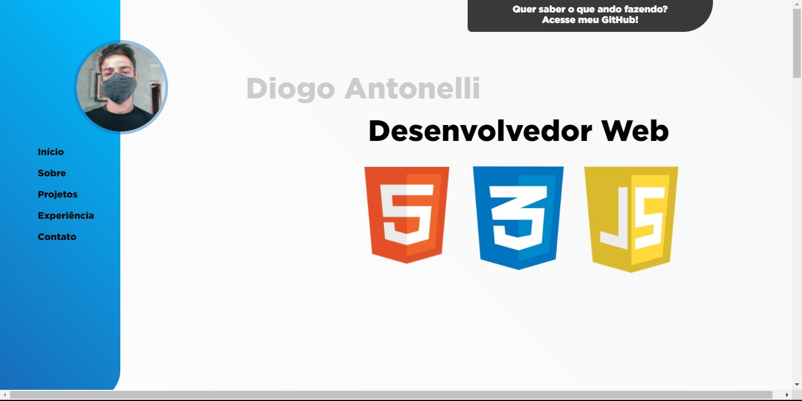
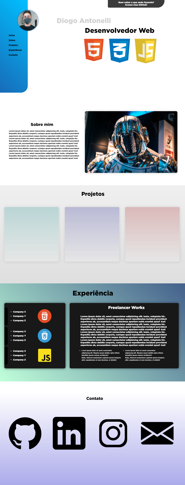

# Página de Portfólio

 Esse projeto tem como finalidade o aprendizado de HTML e CSS que ando tendo ultimamente.
 Decidi me arriscar e tentar algo novo!

 

 
 

<h2 align="center">Sobre</h2>
 

Construí uma página de portfólio somente usando HTML e CSS. Tentei focar em detalhes importantes que tornam um site bonito e útil, desde animações sutis e leves até acessibilidade e facilidade de leitura de um portfólio

 

Peço compreensão se caso não tenha funcionado na sua máquina. Se algo deu errado, sinta-se a vontade para me contatar em alguma rede que deixei anotado no meu perfil :)

 

---
 

By Diogo Antonelli [Veja meu Linkedin](https://www.linkedin.com/in/diogo-antonelli-71351a213/)